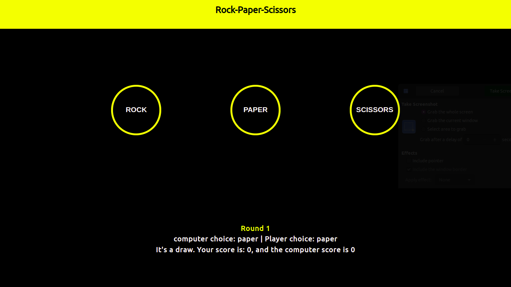

# Rock_Paper_Scissors
This game is a game created using:
* html
* css(responsive web design)
* javascript(dom manipulation)

### here are some screenshots for the page:

## Game Rules:
this game is played between the user and the computer who choose a random choice between rock, paper and scissors.
    The user should select his choice by clicking one of the buttons. The app showes the result of the round and the game keep going on untill one of the players reaches five points to win. 